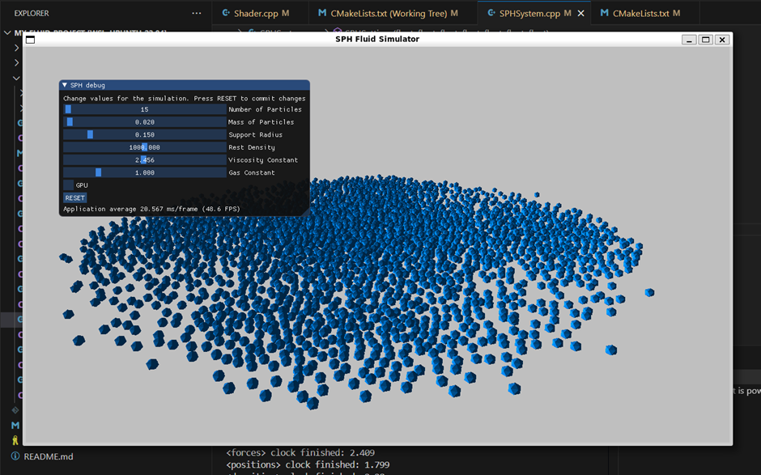
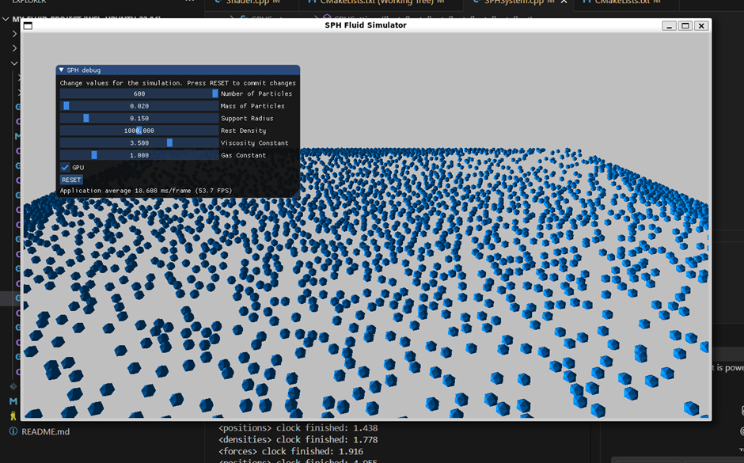

# SPH Fluid Solver Parallelized using CUDA

**[→ View Project Repository](https://github.com/Praful-Joshi/Fluid-Simulation/tree/master)**

This project is a parallelization of an SPH Fluid Solver using CUDA. It builds upon an existing CPU-only implementation by lijenicol and introduces GPU parallelism to significantly improve performance.

<p align="center">
  
</p>

---

## ✨ Features

- CUDA-parallelized SPH simulation
- Multithreaded CPU fallback mode
- Real-time interactive OpenGL rendering
- Adjustable fluid simulation parameters (e.g., viscosity, pressure)
- Modular architecture for easy extension

---

## 📊 Performance

Tested on a system with an NVIDIA GTX 1650 GPU and 8-core CPU:

| Particles | CPU Time (ms) | GPU Time (ms) | Speedup |
|-----------|----------------|----------------|---------|
| 1,500     | 20.6           | 15.3           | 1.34×   |
| 10,000    | 35.8           | 17.9           | 2.00×   |
| 60,000    | 150.3          | 18.6           | 8.08×   |

The GPU version maintains real-time responsiveness (>60 FPS) even at 60,000 particles.

---

## 🔧 Build Instructions (Ubuntu/Linux)

### Step 1: Set GCC/G++ version to 10

```bash
sudo apt install gcc-10 g++-10
sudo update-alternatives --install /usr/bin/gcc gcc /usr/bin/gcc-10 100
sudo update-alternatives --install /usr/bin/g++ g++ /usr/bin/g++-10 100
sudo update-alternatives --config gcc
sudo update-alternatives --config g++
```
Select `gcc-10` and `g++-10` in the prompt.

---

### Step 2: Clean previous builds

```bash
rm -rf build
```

---

### Step 3: Set environment variables for CUDA

```bash
export CC=/usr/bin/gcc-10
export CXX=/usr/bin/g++-10
export CUDAHOSTCXX=/usr/bin/g++-10
```

---

### Step 4: Configure with CMake

```bash
cmake -Bbuild \
  -DCMAKE_C_COMPILER=gcc-10 \
  -DCMAKE_CXX_COMPILER=g++-10 \
  -DCMAKE_CUDA_HOST_COMPILER=/usr/bin/g++-10
```

---

### Step 5: Build

```bash
cmake --build build -j$(nproc)
```

---

## 📂 Project Structure

- `src/` – Core SPH simulation logic (CPU and CUDA)
- `include/` – Data structures, constants, and kernel headers
- `resources/` – Mesh and shader assets
- `build/` – CMake-generated binaries
- `main.cpp` – Entry point and renderer

---

## 📸 Screenshots

| CPU Ray Traced | GPU Real-time |
|----------------|----------------|
|  |  |

---

## 📚 Acknowledgments

Special thanks to the original authors and developers of the CPU SPH implementation for their foundational work, and to Professor Jiajia Li and the Parallel Systems course instructors at NC State for their guidance and support.

---

## 📝 License

This project is for educational and academic use. Licensing terms may vary based on third-party library dependencies (e.g., glm, OpenGL, CUDA).
